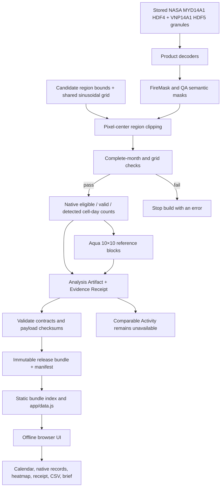

# Fire Season

**Fire Season** is an offline-capable research prototype for NASA Space Apps 2026's [Harmonization of MODIS and VIIRS Hot Spots](https://www.spaceappschallenge.org/2026/challenges/harmonization-of-modis-and-viirs-hot-spots/). It helps a monitoring analyst inspect what two satellite fire-mask products recorded while keeping their measurements separate.

> **Current status:** the repository processes a real, complete March 2023 raster sample for two candidate study windows. It publishes native sensor records only. It does **not** yet contain a validated MODIS–VIIRS transfer, a historical time series, or a scientific result that says how much burning changed.

The project is called **Fire Season**; the team name is **One Last Launch**. The question guiding the product is: **Did recorded burning change, or did the observing system change?**

## What works today

- Decodes stored NASA Aqua MODIS **MYD14A1 Collection 6.1** HDF4 granules and Suomi-NPP VIIRS **VNP14A1 Version 2** HDF5 granules.
- Requires complete daily coverage for March 1–31, 2023, checks grid alignment, and stops the build when coverage or grid checks fail.
- Applies a documented QA rule, clips pixels to two candidate windows by pixel-center membership, and calculates eligible, valid, and detected land-cell-day counts.
- Publishes separate native rates for each product. The rate is `1,000 × detected active land-cell-days ÷ valid observed land-cell-days`.
- Builds an Aqua reference-product heatmap from 10×10 native-grid cells (about 9.3 km at this grid), with a matching selectable data table.
- Creates versioned analysis bundles with an Analysis Artifact, Evidence Receipt, file manifest, checksums, CSV, GeoJSON, evaluation status, and printable brief.
- Renders a static calendar and evidence view with candidate-region selection, native/comparable view controls, observation-support meters, a block heatmap, and provenance details.
- Supports calendar CSV download, receipt JSON download, printable Monitoring Brief, keyboard operation, and a narrow-screen layout.
- Runs in the browser without a runtime API, database, hosted LLM, map token, remote font, or other network dependency.

Blank months mean **no raster sample is bundled**. They are not zero-fire observations. The two native product rates have different measurement systems and must not be read as a direct comparison of true fire activity.

For the detailed inventory and interpretation rules, see [implemented features and current limits](docs/12-CORE-FEATURES.md). For the implementation diagram, see [architecture and data flow](docs/13-ARCHITECTURE-AND-DATA-FLOW.md).

## Sample in the current application

Each region uses five MYD14A1 eight-day granules and 31 VNP14A1 daily granules. Both products cover all 31 dates in the month. Region boundaries are still candidates; the team and local event have not frozen them.

| Candidate window | Role | Bounds (west, south, east, north) | Aqua rate / valid support | VIIRS rate / valid support |
|---|---|---|---:|---:|
| Northeast India–Myanmar | Science Pilot candidate | `93.0, 23.0, 96.0, 26.5` | `2.2081` / `87.5%` | `1.6539` / `89.5%` |
| Chattogram Hills and Cox's Bazar | Local Impact Case candidate | `91.4, 20.6, 92.7, 23.2` | `1.8742` / `88.8%` | `1.0063` / `90.8%` |

Rates are detected active land-cell-days per 1,000 valid observed land-cell-days. These are **native product records**, not harmonized values. The product rates are not directly comparable and do not estimate independent fires, burned area, fire risk, or cause. Full source identities, exclusions, dates, support counts, limitations, and checksums are in each Evidence Receipt.

## Run the application

The browser app is plain static HTML, CSS, and JavaScript. From the repository root, start a local static server:

```sh
python3 -m http.server 8000 --directory app
```

Then open [http://localhost:8000](http://localhost:8000). No JavaScript package install or login is needed to inspect the bundled sample.

## Rebuild the analysis bundle

The raw sample files are stored under `data/timeseries/`. Rebuilding reads those local files; it does not fetch new data or need Earthdata credentials. Create the Python environment and install the pinned science dependencies:

```sh
python3 -m venv venv
venv/bin/python -m pip install -r pipeline/requirements-science.lock
venv/bin/python pipeline/build_research_bundle.py
```

The build validates the analysis and receipt contracts, verifies checksums for an existing immutable release, writes new release bundles atomically, and regenerates `app/data/index.json` and `app/data.js`. A changed region geometry requires a region revision change.

Run the repository checks with:

```sh
venv/bin/python -m unittest discover -s pipeline/tests -v
node --check app/app.js
python3 scripts/check_package.py
```

The Python tests cover raster interpretation, daily coverage and grid invariants, artifact contracts, bundle publication, and exploratory calibrator behavior. `scripts/check_package.py` also checks the repository's static schemas, local documentation links, research record counts, and placeholder text; it writes `output/qa/package-check.json`.

## Architecture at a glance



This is the **implemented** flow. NASA granules are already present locally; there is no live catalog discovery or downloader in the current application path. No calibration is released, so the application preserves native measurements and gives a specific unavailable reason for comparison, anomaly, and investigation priority.

## Repository map

| Path | Purpose |
|---|---|
| `app/` | Static browser application, bundled data, and immutable published releases. |
| `pipeline/fireseason/decoder.py` | Product file parsing and product-specific semantic decoding. |
| `pipeline/fireseason/raster_analysis.py` | FireMask/QA interpretation, pixel coordinates, region masks, grid checks, and block aggregation. |
| `pipeline/fireseason/sample.py` | March 2023 data selection, daily aggregation, source inventory, and candidate region configuration. |
| `pipeline/fireseason/science_release.py` | Native-only Analysis Artifact and Evidence Receipt construction. |
| `pipeline/fireseason/contract.py` | Cross-field validation for artifacts, receipts, manifests, and calibration eligibility. |
| `pipeline/fireseason/calibrator.py` | Exploratory ratio diagnostics; it cannot issue a Calibration Release. |
| `pipeline/build_research_bundle.py` | Atomic bundle publication and browser-data generation. |
| `backend/schemas/` | JSON schemas at the artifact boundary. Legacy database and API designs are not used at runtime. |
| `docs/09-IMPLEMENTATION-STATUS.md` | Evidence-backed status and remaining scientific gates. |
| `docs/12-CORE-FEATURES.md` | User-visible and pipeline feature inventory, including what is not implemented. |
| `docs/13-ARCHITECTURE-AND-DATA-FLOW.md` | As-built system and app-flow diagrams. |
| `research/` | Challenge selection, NASA data research, winning-project review, source records, and duplication audit. |

## Data interpretation and limits

The QA policy counts QA-land pixels as eligible. Clear non-fire land plus nominal/high-confidence fire are valid observations. Nominal/high-confidence fire is counted as detected. Low-confidence fire is excluded from valid support and detections; water, cloud, unknown, and unprocessed cells do not contribute valid support or detections. Support is `valid ÷ eligible`.

The current month is a narrow processing proof, not a harmonization study. The candidate boundaries are not final. There is no independent temporal holdout, geographically separate transfer evaluation, reference-data assessment, calibrated uncertainty interval, activity anomaly, or validated priority rule. `Comparable Activity` stays unavailable until those evaluation gates are implemented and pass. Read [implementation status](docs/09-IMPLEMENTATION-STATUS.md) before using the sample in a presentation or submission claim.

There is no LLM or agentic feature in this version. The product's main contribution is a traceable measurement path; adding a text model would not establish scientific comparability. See the [LLM decision](docs/10-LLM-DECISION.md).

## Planning, research, and decisions

The repository also keeps the original challenge-selection research and target specifications. These describe intended competition scope; they should not be mistaken for completed functionality. The implementation inventory and as-built architecture linked above take precedence when asking what works today.

- [Product requirements](docs/01-PRD.md)
- [Technical requirements and target model protocol](docs/02-TRD.md)
- [Model and data protocol](docs/03-MODEL-AND-DATA-PROTOCOL.md)
- [App flow and design direction](docs/04-APP-FLOW-AND-DESIGN.md)
- [Team and delivery plan](docs/05-TEAM-AND-DELIVERY.md)
- [Backend and artifact schema](docs/06-BACKEND-SCHEMA.md)
- [Relevant repositories and models](docs/07-REPOSITORIES-AND-MODELS.md)
- [Skills audit](docs/08-SKILLS-AUDIT.md)
- [LLM decision](docs/10-LLM-DECISION.md)
- [Design system](docs/11-DESIGN-SYSTEM.md)
- [Challenge comparison](research/challenges/challenge-comparison.md)
- [Previous Space Apps winner research](research/winners/winners-and-competition-research.md)
- [Source register](research/SOURCES.md)
- [Duplication audit](research/duplication-audit.md)
