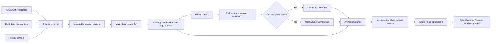
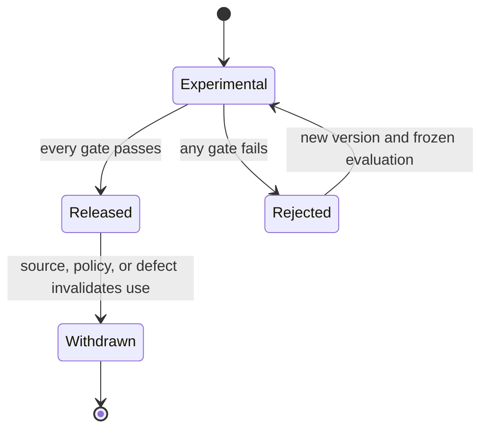

# Fire Season — technical requirements document

Version 2.0  
Status: target technical specification; not an as-built inventory
Prepared: 20 September 2026

> **Implementation note:** this document describes the intended Competition MVP architecture. The code currently uses a local Python raster build and a static vanilla HTML/CSS/JavaScript app. It processes one real month, has no released calibration, and does not yet implement the target ingestion, model, or evaluation stages. See [implementation status](09-IMPLEMENTATION-STATUS.md), [implemented features](12-CORE-FEATURES.md), and [as-built architecture](13-ARCHITECTURE-AND-DATA-FLOW.md) for what runs today.

## System objective

Fire Season converts two documented NASA daily active-fire mask products into an inspectable historical calendar. The system must preserve the native evidence, evaluate a VIIRS-to-Aqua transfer, publish Comparable Activity only after that transfer passes release gates, and deliver the result through an offline-capable static application.

The architecture is split at one stable boundary: the **released Analysis Artifact bundle**. Python owns everything before that boundary. The browser owns presentation after it. The browser never decodes satellite files, fits a model, or changes scientific values.

## Architecture



There is no production database, account system, background worker, or live analysis API in the Competition MVP. The pipeline is a command-line build process. The deployed application consists of static HTML, JavaScript, CSS, geography, and approved Analysis Artifacts.

## Runtime environments

### Science build

- Python 3.12 or another single version frozen before implementation.
- `xarray` for labelled multidimensional arrays.
- `rioxarray` and `rasterio` for geospatial raster access and transforms.
- `numpy` for array operations.
- `pandas` or `polars` for tabular operations; choose one as the default rather than mixing both throughout the pipeline.
- `geopandas` and `shapely` for region and block geometry.
- `statsmodels` for grouped binomial GLM fitting.
- `pyarrow` for Parquet artifacts.
- `pytest` for contract and pipeline tests.
- A locked dependency file with hashes where the selected package manager supports them.

No GPU is required. The paired feasibility sample and the two-region build must run on the team's declared laptop class.

### Web application

- React with TypeScript and Vite.
- SVG or Observable Plot for the calendar and statistical plots.
- MapLibre GL JS only for the compact context map.
- Locally packaged GeoJSON or PMTiles for required geography.
- Browser-native print styles for the one-page Monitoring Brief; PDF generation is optional.
- Playwright for the primary browser path and offline smoke test.

### Delivery

- GitHub Pages or another no-cost static host.
- A locally served `dist` directory as the demonstration fallback.
- No runtime secret, map token, analytics script, model endpoint, or provider login.

## Repository modules

The implementation should use deep modules with small public interfaces.

| Module | Responsibility | Public output |
| --- | --- | --- |
| Source catalog | Query supported product/version/time/region combinations and record provider identifiers. | Source request manifest |
| Retriever | Download exact declared objects and verify size/checksum. | Immutable raw-file inventory |
| Product decoder | Map product-specific mask and QA values to semantic observation states. | Daily semantic mask partitions |
| Grid and region processor | Verify transforms and assign native cells to Curated Regions and 10 km blocks. | Eligible land-cell index |
| Aggregator | Count detected, valid, and eligible land-cell-days by product, block, and month. | Parquet sufficient statistics |
| Calibrator | Fit the declared model ladder from paired support. | Experimental calibration package |
| Evaluator | Score baselines and candidate on frozen temporal and geographic splits. | Evaluation record |
| Release gate | Decide whether a calibration may produce Comparable Activity. | Released or unavailable status |
| Anomaly calculator | Compare a month with the same month in the fixed historical window. | Activity Anomaly fields |
| Artifact publisher | Validate, hash, and atomically publish browser and export artifacts. | Analysis Artifact bundle |
| Static application | Present only released artifact fields and exports. | Offline user experience |

Product-specific bit and class mappings stay inside their decoder. The aggregator receives semantic states such as `detected`, `observed_non_fire`, and `not_observed`; it must not contain MODIS- or VIIRS-specific integer codes.

## Source data contract

### Science stream

| Field | Aqua MODIS | Suomi-NPP VIIRS |
| --- | --- | --- |
| Product | MYD14A1 | VNP14A1 |
| Version | Collection 6.1 | Version 2 |
| Platform | Aqua | Suomi-NPP |
| Nominal daily grid | 1 km | 1 km product grid derived from VIIRS inputs |
| Role | Reference Product | Source product to transfer |

Each source record stores the product short name, version, platform, provider granule ID, observation interval, original URL, retrieval time, offered checksum or ETag, local SHA-256, file size, and access status.

An access status moves through `documented`, `discovered`, `downloaded`, and `decoded`. Catalog discovery alone is not evidence that the product was downloaded or interpreted correctly.

### Recent context stream

FIRMS points retain platform, instrument, acquisition time, latitude, longitude, confidence encoding, day/night flag, scan, track, fire radiative power, collection, and processing status. They remain outside calibration and daily-mask aggregation.

## Observation semantics

Every daily grid cell resolves to one of these semantic states:

| State | Included in eligible land? | Included in valid support? | Detected count? |
| --- | ---: | ---: | ---: |
| `detected` | yes | yes | yes |
| `observed_non_fire` | yes | yes | no |
| `low_confidence_excluded` | yes | no | no |
| `cloud` | yes | no | no |
| `unknown` | yes | no | no |
| `unprocessed` | yes | no | no |
| `water_or_non_land` | no | no | no |
| `outside_region` | no | no | no |

The primary quality policy counts nominal or high-confidence fire as detected, clear non-fire land as valid negative evidence, and excludes low-confidence fire. A sensitivity run may include low-confidence fire. The policy receives a version and appears in every Evidence Receipt.

## Spatial processing

1. Read the actual array, coordinate reference system, transform, fill values, and temporal planes.
2. Fail the source if its expected product structure or documented class mapping does not match.
3. Preserve native tile and pixel identifiers.
4. Use mask-preserving nearest-neighbour operations when a common spatial representation is required. Bilinear interpolation is prohibited for classes.
5. Apply the frozen Curated Region boundary with a documented cell-centroid rule.
6. Assign eligible cells to stable analysis blocks derived from 10 × 10 native 1 km cells. “10 km” is a convenient label; the actual area comes from the grid.
7. Record native and paired support. A paired-fit dataset uses only matching date/grid support from both products.

The pipeline must expose how much support matching removes. Pairing observable dates does not make cloudy dates representative.

## Aggregation

For product `s`, analysis block `g`, and month `t`:

- `F(s,g,t)` is the number of detected active land-cell-days;
- `N(s,g,t)` is the number of valid observed land-cell-days;
- `E(s,g,t)` is the number of eligible land-cell-days.

The native Detected Activity Rate is:

`R(s,g,t) = 1,000 × F(s,g,t) / N(s,g,t)`

`R` is null when `N` is zero. The support fraction is `N/E` when `E` is positive. Counts remain integers in the Competition MVP.

Whole-region values are computed from summed sufficient statistics, not by taking an unweighted mean of block rates.

## Model ladder

The pipeline fits and reports models in this order:

1. identity transfer;
2. seasonal constant or simple monotone transfer;
3. grouped binomial GLM with logit link;
4. beta-binomial or hierarchical logistic extension only if residual dispersion and sample size justify it.

For the GLM, the response is the Aqua detected count out of paired valid support. Candidate predictors are a stabilised VIIRS activity term, seasonal sine and cosine, and support fractions. A land-cover term may be added only if the open dataset, sample support, and diagnostic value are documented before held-out evaluation.

Tree ensembles, deep neural networks, and foundation models are not part of the first calibration engine. A more complex model is not accepted solely because it produces a better pooled score.

## Split and evaluation protocol

Temporal and geographic splits are frozen before the untouched test is inspected. The working temporal template is:

- training: 2013–2019;
- model and threshold selection: 2020–2021;
- untouched test: 2022–2024.

These years may move after coverage inspection, but the final choice is recorded before test scoring. Neighbouring spatial blocks and adjacent seasonal sequences stay together during resampling.

The evaluator reports:

- mean absolute error on the rate scale;
- signed bias;
- peak-month timing error;
- skill relative to identity and the best seasonal baseline;
- nominal 90% interval coverage and width;
- performance by region, season, activity stratum, and support stratum;
- geographically separate transfer performance;
- sensitivity to the low-confidence-fire policy.

Uncertainty starts with annual and spatial block bootstrap resampling. Two hundred fits is a planning default; the final count and block definition follow runtime and residual-dependence checks.

## Calibration lifecycle



The release gate checks:

- source and Reference Product identity and version;
- quality-policy and grid version;
- training and held-out support;
- at least 10% held-out MAE improvement over the best simple baseline;
- no material bias regression in either pilot;
- peak timing within one month where identifiable;
- 85–95% empirical coverage for the nominal 90% interval;
- geography, activity, support, and covariate domain;
- independent Transfer Test Region report;
- model, environment, split, and source checksums.

A withdrawn release remains resolvable from historical receipts. New analyses use an eligible replacement or abstain; past artifacts are not silently rewritten.

## Comparison and anomaly states

`comparison_status` is one of:

- `available`;
- `insufficient_observation_support`;
- `insufficient_overlap`;
- `insufficient_training_support`;
- `out_of_domain`;
- `incompatible_product`;
- `calibration_not_released`;
- `calibration_withdrawn`.

Only `available` carries an estimate and interval. Every other state carries null numeric comparison fields and a reason.

An Activity Anomaly compares a selected month with the same calendar month in a fixed baseline. The selected year is excluded. A percentile requires at least eight usable baseline years; with fewer years the UI receives a rank and range or an unavailable state. The result is descriptive and does not become a forecast.

## Analysis Artifact boundary

The publisher produces one immutable bundle per region release:

```text
release/<artifact_id>/
├── analysis.json
├── evidence-receipt.json
├── calendar.csv
├── block-month.parquet
├── evaluation.json
├── region.geojson
├── monitoring-brief.html
└── manifest.json
```

`analysis.json` is the browser contract. `manifest.json` lists every distributable file except itself, together with media type, byte size, and SHA-256. To avoid recursive hashes, `analysis.json` lists only related payload files and excludes itself, the receipt, and the manifest. The Evidence Receipt lists `analysis.json` and related payloads but excludes itself and the manifest. Publishing succeeds only after all files validate and the final manifest agrees with both inventories.

The formal JSON contracts live in the backend schema directory. The detailed logical and Parquet schemas are defined in the backend-schema document.

## Atomic publication

The publisher writes to a staging directory, validates every schema and cross-file invariant, computes checksums, then renames the complete directory to its final artifact ID. It never mutates a released directory. A failed run keeps its logs and staging evidence but cannot replace the previous release.

The static application reads an index containing only released artifact IDs. An experimental or partial artifact cannot become visible by being present on disk.

## Browser behavior

The application loads a small region index, then the selected region's `analysis.json`. It may lazy-load region geography, detailed evidence, and export files. It does not calculate Comparable Activity, eligibility, interval bounds, anomaly status, or Investigation Priority.

The browser may derive purely presentational state such as sorting, selected month, formatted labels, and chart coordinates. Any transformation that could change scientific meaning belongs in the Python publisher.

## Error handling

Pipeline failures and scientific unavailability are different.

| Category | Example | Published result |
| --- | --- | --- |
| Source failure | checksum mismatch or unreadable file | no new artifact; previous release remains |
| Decode failure | undocumented class or wrong shape | no new artifact |
| Evaluation failure | candidate does not beat baseline | artifact with native evidence and unavailable comparison |
| Domain failure | local region outside released range | artifact with native evidence and unavailable comparison |
| Browser load failure | missing or corrupted bundled file | explicit application error naming the file; no stale substitution |

Logs may contain local paths and HTTP status codes but never Earthdata credentials or secret headers.

## Security and privacy

The Competition MVP stores no user identity or user-generated data. It sends no analytics and uses no tracking pixel. Provider credentials exist only in local environment variables during source retrieval. `.env.example` documents variable names without values.

All downloaded and bundled resources must have a documented public-use basis. NASA branding is not altered or used to imply endorsement. AI-assisted code, documentation, images, or data work is disclosed according to the final event rules.

## Performance budgets

| Operation | Budget |
| --- | ---: |
| Initial compressed application assets, excluding optional map tiles | 1.5 MB target |
| Region index | 50 KB target |
| One region `analysis.json`, compressed | 500 KB target |
| Cached region open on test laptop | 2 seconds |
| Month selection after load | 300 ms |
| Calendar keyboard movement | next animation frame |
| Local build startup | 10 seconds |

If block-level detail exceeds the artifact budget, it is partitioned by year or loaded from compact binary/Parquet-derived JSON rather than expanding the core analysis file indefinitely.

## Test strategy

The shared high-level seam is the released Analysis Artifact bundle.

1. A small pinned real paired-granule fixture passes through decoding, aggregation, release decision, and publication.
2. Contract tests validate the published JSON and cross-file checksums.
3. Browser tests consume that exact artifact and complete the primary user path.
4. Export tests compare the screen, CSV, receipt, and Monitoring Brief values.
5. An offline smoke test runs the static build with network access disabled.

Synthetic arrays are appropriate for individual mask and failure-state edge cases. They do not replace the real paired-granule integration fixture.

## Build sequence

The first implementation slice ends at Native Sensor Records and Observation Support. The second adds baselines and evaluation. The third publishes either Comparable Activity or a tested unavailable state. The fourth completes the browser path and exports. Optional context and explanation features come last.

Science and frontend work can proceed in parallel after the `analysis.json` contract and one fixture are frozen. Schema changes require both owners to update the contract test before either side merges the change.

## Post-MVP architecture

The existing PostgreSQL/PostGIS and OpenAPI designs are retained only as post-MVP references. A future service may add authenticated regions, live jobs, object storage, and an API after the static product proves useful. Those components do not define the competition build and must not appear in the judged dependency path.
