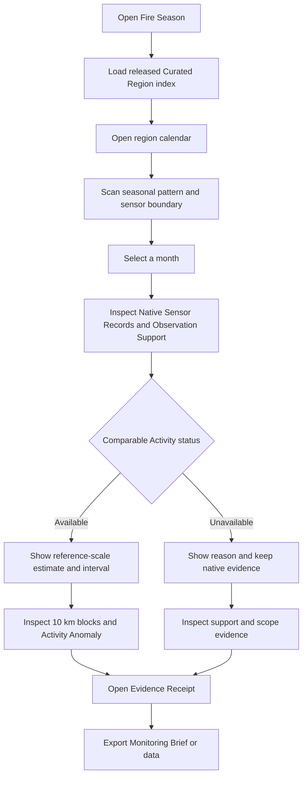

# Fire Season — application flow and interface specification

Version 2.0  
Status: approved interaction direction for the Competition MVP  
Prepared: 20 September 2026

## Experience thesis

Fire Season should feel like an evidence instrument used during a planning meeting. The calendar is the product, not a chart hidden behind a marketing page. Its shape should make the satellite transition, seasonal rhythm, and missing observation support visible before the user opens any detail.

The visual reference is a field-season ledger: measured rows, readable marginal notes, and restrained marks that mean something. The design avoids the visual language of an emergency operations centre. There is no red-alert chrome, rotating globe, wall of counters, or chat prompt competing with the evidence.

## Information architecture

The static application has one main route and two document views.

| Route | Purpose | Persistent state |
| --- | --- | --- |
| `/` | Region calendar and selected-month investigation | region, view, selected month, selected block |
| `/receipt/:receiptId` | Human-readable Evidence Receipt | receipt ID and source artifact |
| `/brief/:artifactId/:month` | Printable Monitoring Brief | artifact ID and selected month |

CSV, JSON, and Parquet-derived downloads are files rather than application routes. A shared link may encode region, view, and month in URL search parameters. The application ignores unsupported parameters and returns to a valid Curated Region.

## Primary flow



This path must work without network access after the static application has loaded from the local build.

## Opening state

The application opens on the Science Pilot and the first preselected demonstration month only when that month is a released, real result. Otherwise it opens with no month selected. The first viewport contains:

- product name and one-sentence measurement description;
- Curated Region control and region role;
- Native Sensor Records / Comparable Activity segmented control;
- measurement unit and period;
- complete year-by-month calendar;
- visible sensor-era marker;
- compact source and release status.

There is no hero illustration. The live calendar is the opening visual.

## Desktop composition

```text
┌────────────────────────────────────────────────────────────────────────────┐
│ Fire Season                           Region  [Science Pilot ▾]   Evidence │
│ Did recorded burning change, or did the observing system change?          │
├────────────────────────────────────────────────────────────────────────────┤
│ Native Sensor Records  [ Comparable Activity ]       2013–2024            │
│ Detected active land-cell-days per 1,000 valid observed land-cell-days     │
│                                                                            │
│       Jan Feb Mar Apr May Jun Jul Aug Sep Oct Nov Dec      source/support  │
│ 2013   ·   ·   ▪   ▰   ▪   ·   ·   ╱   ·   ·   ·   ·       Aqua MODIS   │
│ 2014   ·   ▪   ▰   █   ▪   ·   ·   ·   ·   ·   ·   ·       82% valid    │
│ ...                                                                        │
│ ─────────────── sensor overlap / reference boundary ─────────────────────  │
│ 2024   ·   ▪   █   █   ▰   ·   ·   ·   ·   ·   ·   ·       VIIRS        │
├───────────────────────────────────────┬────────────────────────────────────┤
│ Selected month: March 2024            │ Observation support                │
│ Native records and comparison plot    │ Context map / 10 km block table    │
│ Interval and anomaly explanation      │ Investigation Priority             │
├───────────────────────────────────────┴────────────────────────────────────┤
│ Receipt FS-…       Download CSV       Open Monitoring Brief                │
└────────────────────────────────────────────────────────────────────────────┘
```

The calendar sits on one continuous surface. Thin horizontal rules separate reading zones. Detail areas may use white work surfaces, but the screen must not become a collection of identical rounded cards.

## Narrow-screen composition

The narrow layout preserves the question and evidence order. It does not shrink the full matrix until labels become illegible.

```text
Fire Season
[Science Pilot ▾]

[Native records | Comparable activity]
Year [2024 ▾]

March
████  18.4 per 1,000
82% valid support
Estimated on Aqua reference scale
[Inspect March]

April
███   14.1 per 1,000
...
```

One selected year becomes a vertical list of twelve month rows. The map follows the evidence and has a table alternative directly beside it. Receipt and brief actions remain reachable without opening an overflow menu.

## Screen and panel specification

### Region calendar

**Job:** locate the usual season and a month worth inspecting.

**Required content:**

- region name and role;
- covered years;
- active view;
- metric and unit;
- source-era strip;
- twelve labelled month columns;
- one row per year;
- activity encoding;
- support encoding;
- legend with plain-language definitions;
- source and calibration status.

Each calendar cell is a single interactive element. Its accessible name follows this structure:

`March 2024; Comparable Activity 18.4 per 1,000; 90% interval 14.2 to 22.8; 82% valid support; comparison available.`

For an unavailable cell:

`March 2024; comparison unavailable; 31% valid support, below the 50% threshold; native VIIRS record available.`

### Month evidence panel

**Job:** understand how the selected value was produced.

The panel contains, in order:

1. period and selected region;
2. Native Sensor Records, with separate product identities;
3. Comparable Activity status;
4. interval and Activity Anomaly;
5. Observation Support counts and exclusions;
6. calibration scope and evaluation summary;
7. links to the Evidence Receipt and exports.

The panel may open below the calendar on wide screens and as a full-height sheet on narrow screens. Closing it returns focus to the selected calendar cell.

### Context map and block table

**Job:** locate the region and identify blocks that deserve review.

The map uses locally packaged geography and MapLibre. It shows the Curated Region boundary, 10 km analysis blocks, and selected block. It does not render a global fire-dot layer by default. Blocks use the same activity/support semantics as the calendar.

The adjacent table lists block ID, Comparable Activity or unavailable status, Observation Support, and Investigation Priority. Selecting a map block selects the table row and vice versa.

### Evidence Receipt

**Job:** audit the analysis without reading source code.

The receipt page presents:

- artifact and receipt IDs;
- region revision and time span;
- source products, versions, provider IDs, and checksums;
- quality-policy and grid versions;
- excluded observation counts by reason;
- calibration direction, release status, and domain;
- frozen split and evaluation measures;
- interval method;
- software revision and environment lock checksum;
- known limitations;
- distributable file inventory.

Long identifiers may wrap. Copy buttons must have text labels and confirmation that does not depend on a toast disappearing quickly.

### Monitoring Brief

**Job:** carry one qualified result into a planning discussion.

The brief is one printable page at A4 and US Letter widths. It includes the selected calendar slice, native/comparable distinction, support, anomaly, block priorities, limits, and receipt ID. It does not contain an AI-written executive summary.

## View control behavior

The two views are named **Native Sensor Records** and **Comparable Activity**.

Switching views keeps the selected region and month. The calendar legend, source-era treatment, evidence panel, and accessible labels update together. A transition may cross-fade values for 120–180 ms, but reduced-motion users receive an immediate update.

If Comparable Activity is unavailable for the selected month, the user remains in that view. The cell displays the unavailable pattern and reason instead of switching back automatically. Native evidence appears in the detail panel with a clear link to the native view.

## Calendar visual grammar

The calendar carries three independent dimensions:

| Meaning | Encoding |
| --- | --- |
| Activity magnitude | filled bar or area within the cell plus numeric detail on focus/selection |
| Observation Support | small baseline marker and text in detail; hatch when support is inadequate |
| Sensor or estimate type | source-era rail, label, and view state |

The application never uses opacity alone to imply support because low opacity can be mistaken for low activity. Missing evidence uses a diagonal hatch. Uncertainty appears only in the selected-month plot as an interval band or whisker.

## Visual system

### Palette

| Token | Value | Use |
| --- | --- | --- |
| `paper` | `#F2F5F3` | application background |
| `work-surface` | `#FFFFFF` | focused reading surfaces and print |
| `basalt` | `#182A30` | primary text and strong rules |
| `slate` | `#52656B` | secondary text |
| `observation-blue` | `#2C6674` | selected controls and observed support |
| `activity-ember` | `#B94A2C` | activity marks, used sparingly |
| `missing-grey` | `#87969A` | hatch strokes and unavailable status |
| `focus-blue` | `#075FDB` | keyboard focus outline |
| `rule` | `#CBD5D2` | dividers and cell boundaries |

The calendar uses a tested sequential scale derived from `paper` to `activity-ember`. Text never sits on an untested midpoint color. The implementation must run automated and manual contrast checks rather than assuming these tokens pass in every pairing.

### Typography

- IBM Plex Sans: controls, values, annotations, and body text.
- IBM Plex Serif: the product question, page titles, and Monitoring Brief heading.
- System sans-serif and serif fallbacks are defined.
- Both font families are bundled locally under their open licences and recorded in the asset manifest.

The serif appears only where a human reader would pause. Data labels remain sans-serif. Numeric tables use tabular numeral features from IBM Plex Sans rather than a decorative monospace face.

### Shape and spacing

- Base spacing unit: 4 px.
- Main content max width: 1,440 px.
- Calendar row height: 32–40 px on desktop.
- Controls: minimum 44 px touch target where layout permits.
- Corner radii: 2–6 px for interactive surfaces; the calendar grid remains square.
- Shadows: none in the primary analytical surface. A narrow-screen sheet may use one restrained elevation shadow.

Rules, hatches, and labels convey data structure. Decorative orbit lines, stars, flames, and circuit motifs are excluded.

## Product language

| Avoid | Use |
| --- | --- |
| No fires | No usable observations, or no detected activity, as appropriate |
| True fire activity | Estimated on the Aqua reference scale |
| Fire risk | Detected activity or Investigation Priority |
| High danger | Higher than this region's March baseline |
| AI-corrected | Comparable Activity from calibration FS-CAL-… |
| Error | Comparison unavailable: reason |
| Confidence score | Observation Support or interval coverage, whichever is meant |

Buttons name the resulting action: `Open evidence`, `Download CSV`, `Print Monitoring Brief`, and `Copy receipt ID`.

## Empty, unavailable, and error states

### No observed activity

Display a valid zero with its support: `No detected active cell-days across 91% valid observation support.`

### No usable observations

Display no numeric activity value: `No usable observations for this month. Cloud, unknown, or unprocessed cells left 12% valid support.`

### Comparison unavailable

Display the specific reason and the next useful action: `Comparison unavailable: this month has 31% valid support; the release requires at least 50%. Inspect the native VIIRS record.`

### Artifact load failure

Do not show the previous region under the new region label. Display: `The released analysis file could not be verified. Reopen the local demo or choose the other region.` Include the artifact ID and failed file name.

### Local case not released

The region remains selectable as an evidence of scope: `Native records are available. Comparable Activity has not been released for this region because geographic transfer did not pass.`

## Accessibility behavior

### Calendar keyboard model

- Tab enters the calendar at the selected or first available cell.
- Arrow Left/Right moves by month.
- Arrow Up/Down moves by year.
- Home/End moves to January/December of the row.
- Page Up/Page Down moves to the same month in the previous/next available year.
- Enter or Space selects the month and opens evidence.
- Escape closes the narrow-screen sheet and returns focus.

The calendar follows a single-tab-stop grid pattern when implemented with grid semantics. A plain table with links is acceptable if it proves more reliable with screen readers; semantic correctness takes priority over a custom ARIA grid.

### Nonvisual equivalents

- The calendar has a sortable tabular alternative.
- The plot has a text summary and data table.
- The map has a block table containing every decision-relevant value.
- Hatch and source-era distinctions have text labels.
- Live-region announcements are limited to completed view and selection changes.

## Demo flow

The rehearsed judge path is deliberately short:

1. Open the Science Pilot calendar and state the question.
2. Select the prepared real month showing an apparent cross-era increase.
3. Point to the sensor boundary and Native Sensor Records.
4. Switch to Comparable Activity and show what remains after the released transfer.
5. Show Observation Support and interval, then open the Evidence Receipt.
6. Switch to the Local Impact Case or a prepared month that returns an Unavailable Comparison.
7. End on the Monitoring Brief and its Investigation Priority.

The exact month and conclusion are chosen from real released artifacts. The design does not assume that harmonization will make a trend disappear.

## Agent boundary

There is no chat surface in the Competition MVP. Fixed contextual links such as `What does this measure?` open written explanations tied to the current artifact.

A later Evidence Investigator may answer a short set of questions by reading released Analysis Artifacts. It must cite receipt fields, surface uncertainty, abstain outside scope, and fall back to deterministic text. It cannot fetch unrestricted internet content, fit models, revise Investigation Priorities, or change any displayed number.

## Design acceptance checklist

- The calendar is visible in the first laptop viewport.
- The source-era transition is identifiable without opening a tooltip.
- Activity, support, uncertainty, and unavailable states use different encodings.
- A keyboard user can complete the main path.
- Every map fact needed for a decision exists in the block table.
- The narrow layout remains readable at 320 CSS pixels.
- The page remains usable at 200% zoom.
- Print output fits the Monitoring Brief onto one page without clipped evidence.
- No network request is required after loading the local build.
- No element suggests prediction, emergency control, or NASA endorsement.
