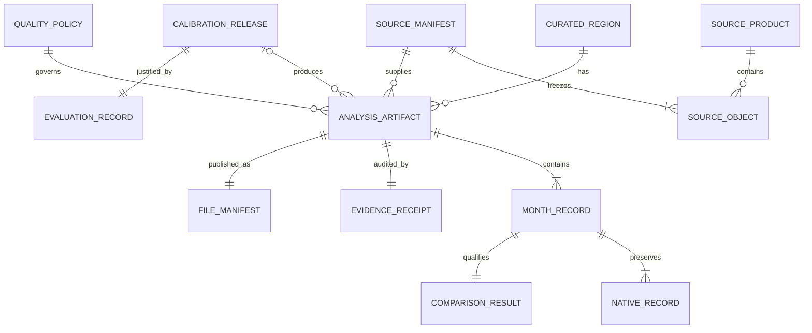

# Fire Season — artifact and backend schema

Version 2.0  
Status: authoritative Competition MVP data contract  
Prepared: 20 September 2026

## Architecture premise

The Competition MVP has a build-time scientific backend and a static runtime. There is no runtime database or write API. The Python pipeline retrieves source data, creates analytical tables, evaluates calibration, and publishes an immutable **Analysis Artifact** bundle. The React application reads that bundle.

The word “backend” in this document refers to the pipeline, release rules, analytical storage, and publication contract. The existing PostgreSQL and OpenAPI designs describe a possible later service and do not belong to the judged dependency path.

## Domain relationships



An Analysis Artifact may omit a Calibration Release only by publishing every Comparison Result as unavailable. Native evidence remains valid when calibration is absent.

## Identifier rules

Identifiers are lowercase, URL-safe, immutable, and meaningful only as identifiers.

| Entity | Format | Example |
| --- | --- | --- |
| Curated Region | `region_<slug>_r<revision>` | `region_chattogram_hills_r1` |
| Source product | `<short_name>_<version>_<platform>` | `myd14a1_061_aqua` |
| Source manifest | `src_<12 hex>` | `src_4b5e62a92d1c` |
| Calibration | `cal_<source>-to-<reference>_v<semver>` | `cal_vnp14a1-to-myd14a1_v1.0.0` |
| Analysis Artifact | `art_<region>_<release>_<12 hex>` | `art_ne-india-myanmar_2026-11_64c0c8fca331` |
| Evidence Receipt | `rcpt_<artifact suffix>` | `rcpt_64c0c8fca331` |
| Analysis block | `<region id>_b<row>_<col>` | `region_chattogram_hills_r1_b12_07` |

The 12-character suffix is derived from the canonical input or manifest SHA-256. Full checksums are still stored.

## Release bundle

```text
release/<artifact_id>/
├── analysis.json
├── evidence-receipt.json
├── calendar.csv
├── block-month.parquet
├── evaluation.json
├── region.geojson
├── monitoring-brief.html
└── manifest.json
```

`analysis.json` is the only file required to render the calendar and selected-month evidence. The application may lazy-load the receipt, geography, and exports. `manifest.json` is the final file written during publication.

## Analysis Artifact contract

The machine-readable schema is `backend/schemas/analysis-artifact.schema.json`. The root object contains these fields:

| Field | Type | Meaning |
| --- | --- | --- |
| `schema_version` | semantic-version string | Version of the JSON contract. |
| `artifact_id` | string | Immutable analysis release ID. |
| `release_status` | enum | `released` or `native_only`. |
| `generated_at` | UTC date-time | Publication time, excluded from scientific identity. |
| `region` | object | Curated Region ID, revision, role, name, geometry reference, and checksum. |
| `period` | object | Inclusive first and last analysis dates. |
| `metric` | object | Metric ID, label, unit, scale, and definition. |
| `reference_product_id` | string | Source-product ID defining Comparable Activity scale. |
| `sources` | array | Exact products used by this artifact. |
| `quality_policy` | object | Version and monthly support threshold. |
| `calibration` | object or null | Calibration identity, lifecycle status, transfer direction, evaluation reference, and domain summary. |
| `months` | array | One record for each released calendar month. |
| `receipt_ref` | string | Relative URL of the Evidence Receipt. |
| `files` | array | Related payload paths, media types, byte sizes, and SHA-256 checksums. It excludes `analysis.json`, the receipt, and the final manifest to avoid recursive hashes. |
| `limitations` | array of strings | Material interpretation limits displayed by the app and brief. |

Unknown root properties fail validation. This prevents a producer from adding an unreviewed scientific field that an older frontend might misinterpret.

### Source product

| Field | Type | Constraint |
| --- | --- | --- |
| `product_id` | string | Unique within the artifact. |
| `short_name` | string | Provider product name. |
| `version` | string | Explicit collection/version. |
| `platform` | string | `Aqua`, `Suomi-NPP`, or another separately evaluated platform. |
| `stream` | enum | `science_mask` or `recent_context`. |
| `nominal_resolution_m` | integer | Positive. |
| `source_url` | URI | Public provider or catalog URL. |
| `product_guide_url` | URI | Documentation used for decoding. |

The frontend joins Native Sensor Records to sources by `product_id`; it never infers identity from display labels.

### Month record

| Field | Type | Meaning |
| --- | --- | --- |
| `month` | `YYYY-MM` | Calendar month. |
| `native_records` | array | One observed record per available science product. |
| `comparison` | object | Available or unavailable Comparable Activity. |
| `anomaly` | object | Same-month historical comparison or unavailable reason. |
| `investigation_priority` | object | Review status and referenced block IDs. |

Months are unique and sorted ascending. The publisher checks sequence and uniqueness; the browser does not repair them.

### Native record

| Field | Type | Constraint |
| --- | --- | --- |
| `product_id` | string | Must resolve to a `science_mask` source. |
| `observation_status` | enum | `available`, `insufficient_support`, or `no_observation`. |
| `detected_cell_days` | integer or null | Non-negative; null only for no observation. |
| `valid_cell_days` | integer | Non-negative. |
| `eligible_land_cell_days` | integer | Positive. |
| `support_fraction` | number | `valid / eligible`, within stored tolerance. |
| `rate_per_1000` | number or null | `1,000 × detected / valid` when valid is positive. |

A valid zero has `detected_cell_days = 0`, positive `valid_cell_days`, and `rate_per_1000 = 0`. It is different from `no_observation`, where `valid_cell_days = 0` and the rate is null.

### Comparison Result and Unavailable Comparison

| Field | Type | Constraint |
| --- | --- | --- |
| `status` | enum | See status vocabulary below. |
| `estimate_per_1000` | number or null | Present only when status is `available`. |
| `lower_90` | number or null | Present with an available estimate. |
| `upper_90` | number or null | Present with an available estimate. |
| `interval_method` | string or null | Required with bounds. |
| `calibration_id` | string or null | Required only when available. |
| `reason` | string or null | Required when unavailable; null when available. |

The JSON Schema enforces the basic conditional rules. Every non-`available` result is an **Unavailable Comparison** with null numeric fields and a specific reason. The publisher enforces cross-reference and domain rules.

### Activity Anomaly

| Field | Type | Meaning |
| --- | --- | --- |
| `status` | enum | `available`, `indeterminate`, or `unavailable`. |
| `baseline_start_year` | integer or null | First baseline year. |
| `baseline_end_year` | integer or null | Last baseline year. |
| `usable_baseline_years` | integer | Count after exclusions. |
| `rank` | integer or null | Rank among comparable same-month records. |
| `percentile` | number or null | Used only with at least eight usable years. |
| `difference_per_1000` | number or null | Selected value minus baseline centre. |
| `reason` | string or null | Required unless status is available. |

The queried year cannot appear in the baseline-year set used by the pipeline.

## Status vocabulary

### Artifact release

- `released`: at least one eligible Calibration Release supports Comparable Activity.
- `native_only`: native evidence is published, but no comparable result is eligible.

### Comparison

- `available`
- `insufficient_observation_support`
- `insufficient_overlap`
- `insufficient_training_support`
- `out_of_domain`
- `incompatible_product`
- `calibration_not_released`
- `calibration_withdrawn`

### Investigation Priority

- `review`: evidence supports additional human review.
- `routine`: no additional review signal under the declared rule.
- `unavailable`: evidence cannot support a priority.

Investigation Priority is computed from released artifact rules. It is not a safety or dispatch code.

## Evidence Receipt contract

The receipt schema is `backend/schemas/evidence-receipt.schema.json`. A receipt contains:

| Group | Required content |
| --- | --- |
| Identity | receipt ID, artifact ID, schema version, publication time |
| Region | region ID, revision, role, geometry checksum |
| Analysis | inclusive dates, metric ID, reference product, grid version, quality-policy version |
| Sources | product and platform, provider object IDs, observation intervals, retrieval dates, source URLs, file sizes, and full SHA-256 checksums |
| Exclusions | counts by semantic exclusion reason and product |
| Calibration | calibration ID or null, lifecycle status, source/reference direction, training manifest, model checksum, code revision, evaluation file reference |
| Evaluation | split manifest, baseline scores, candidate scores, interval method and coverage, transfer-test result, release-gate result; the embedded record must match the referenced JSON payload checksum |
| Environment | Python version, dependency-lock checksum, operating-system note, pipeline revision |
| Limitations | material interpretation and transfer limits |
| Files | `analysis.json` and related payload checksums; the receipt and final manifest are excluded to avoid recursive hashes |

Credentials, signed URLs, cookies, local home-directory paths, and raw authorization headers are prohibited.

## Source manifest

The source manifest is newline-delimited JSON or Parquet with one row per provider object:

| Column | Type | Null? |
| --- | --- | --- |
| `source_manifest_id` | string | no |
| `product_id` | string | no |
| `provider_object_id` | string | no |
| `source_url` | string | no |
| `observed_start_utc` | timestamp | no |
| `observed_end_utc` | timestamp | no |
| `retrieved_at_utc` | timestamp | no |
| `provider_checksum` | string | yes |
| `sha256` | fixed 64-char string | no |
| `size_bytes` | int64 | no |
| `decode_status` | enum | no |
| `decoder_version` | string | yes until decoded |

The manifest ID is derived from canonical rows sorted by product ID and provider object ID.

## Analytical Parquet schemas

### Daily semantic observations

Partition recommendation: `product_id/year/tile`.

| Column | Type | Meaning |
| --- | --- | --- |
| `product_id` | string | Exact product/platform/version ID. |
| `provider_object_id` | string | Source object provenance. |
| `source_sha256` | fixed string | Downloaded object checksum. |
| `date` | date32 | Observation date represented by the daily plane. |
| `native_tile` | string | Provider tile identity. |
| `native_row` | int32 | Native grid row. |
| `native_col` | int32 | Native grid column. |
| `region_id` | string | Frozen Curated Region revision. |
| `block_id` | string | Stable 10 km analysis block. |
| `semantic_state` | dictionary string | One of the declared observation states. |
| `quality_policy_version` | string | Decoder/acceptance policy. |

Rows outside the Curated Region do not need to be retained in the release workspace after source checks are complete.

### Block-month sufficient statistics

Partition recommendation: `artifact_id/product_id/year`.

| Column | Type | Constraint |
| --- | --- | --- |
| `artifact_id` | string | Published analysis identity. |
| `region_id` | string | Curated Region revision. |
| `block_id` | string | Stable analysis block. |
| `product_id` | string | Science product. |
| `month` | date32 | First day of month. |
| `eligible_land_cell_days` | int64 | Greater than zero. |
| `valid_cell_days` | int64 | Between zero and eligible. |
| `detected_cell_days` | int64 | Between zero and valid. |
| `support_fraction` | float64 | Valid divided by eligible. |
| `rate_per_1000` | float64 nullable | Null when valid is zero. |
| `paired_valid_cell_days` | int64 nullable | Common support used for fitting/evaluation. |
| `comparison_status` | dictionary string | Status vocabulary. |
| `comparable_rate_per_1000` | float64 nullable | Only when comparison is available. |
| `lower_90` | float64 nullable | Only with comparable value. |
| `upper_90` | float64 nullable | Only with comparable value. |
| `calibration_id` | string nullable | Required with comparable value. |

Rates remain bounded from 0 to 1,000. Counts remain the source of truth for re-aggregation.

### Calibration evaluation

One JSON record per candidate and split contains:

- calibration ID and lifecycle status;
- source and Reference Product IDs;
- feature contract and preprocessing version;
- training, selection, held-out, and Transfer Test Region manifests;
- sample and positive counts;
- identity, seasonal-baseline, and candidate MAE;
- signed bias by evaluated region;
- peak-month timing error;
- nominal interval level, empirical coverage, and mean width;
- domain bounds and support thresholds;
- every release-gate result with observed value, comparator, threshold, and pass/fail;
- model-object checksum, code revision, and dependency-lock checksum.

The final gate is `pass` only when every required sub-gate is `pass`. A missing metric is not a pass.

The Python artifact contract enforces this rule before an artifact can set `release_status` to `released`: it requires at least five training and two untouched held-out seasons, the positive-block diagnostic floor, paired support at the declared minimum, a recomputed 10% improvement over the best simple baseline, per-pilot bias comparisons with explicit tolerances, eligible peak timing, nominal-90% interval coverage, an identified separate transfer region, and every named gate result. The calibration domain must match the source/reference product versions, quality-policy and grid versions, include the artifact and transfer-test regions, and contain the displayed source and comparable rates. The target region geometry and held-out transfer geometry each require a distinct GeoJSON reference, a checksum matching the actual payload, a feature region ID and bounds matching their declarations, and polygon coordinates matching the declared west/south/east/north bounds. The contract rejects overlapping target and transfer bounding boxes. Training, split, model, and evaluation references must resolve to checksummed files. The artifact and receipt must agree on every shared calibration identity, domain, model-provenance, and evaluation-reference field, and the evaluation bytes must match that file checksum in both manifests. Before reusing an immutable release, the publisher compares complete size, media type, and checksum records across the artifact, receipt, manifest, and on-disk files. A failed or missing item leaves the artifact native-only with unavailable comparison values.

## File manifest

`manifest.json` follows `backend/schemas/release-manifest.schema.json` and contains:

```json
{
  "schema_version": "1.0.0",
  "artifact_id": "art_...",
  "files": [
    {
      "path": "analysis.json",
      "media_type": "application/json",
      "size_bytes": 12345,
      "sha256": "64 lowercase hexadecimal characters"
    }
  ]
}
```

The manifest lists `analysis.json`, `evidence-receipt.json`, and every related payload. It does not list itself because its checksum would be recursive. The release index stores the manifest checksum. `analysis.json` excludes itself, the receipt, and the manifest from its `files` array. The receipt excludes itself and the manifest. The publisher checks these deliberately different inventories.

## Cross-file invariants

JSON Schema validation is necessary but not sufficient. Publication must also prove:

1. every `product_id` used by a month resolves to exactly one declared source;
2. every source used by the artifact appears in the receipt and source manifest;
3. every file reference is relative, stays inside the bundle, and matches its checksum;
4. region ID, artifact ID, time span, metric, quality policy, Reference Product, and calibration agree across all files;
5. month records are unique, ordered, and inside the artifact period;
6. `support_fraction = valid / eligible` within floating-point tolerance;
7. native rate equals `1,000 × detected / valid` when valid is positive;
8. whole-region counts equal the sum of included block counts;
9. available comparison values resolve to one eligible Calibration Release;
10. unavailable comparisons have null estimates, bounds, interval methods, and calibration IDs;
11. interval bounds satisfy `0 ≤ lower ≤ estimate ≤ upper ≤ 1,000`;
12. the selected year is absent from its anomaly baseline;
13. Investigation Priority cannot be `review` when its comparison or support rule is unavailable;
14. a `native_only` artifact contains no available comparison;
15. the Monitoring Brief and CSV values match the Analysis Artifact for their selected month.
16. a `released` artifact contains a released calibration and at least one available comparison;
17. the final manifest lists every bundle file except itself exactly once.

## Canonicalisation and checksums

Published JSON payloads use UTF-8, sorted object keys, two-space indentation, and a trailing newline. Arrays keep semantic order and are not sorted during hashing. Floating-point values are rounded once by the publisher to the declared display/storage precision before serialization.

The scientific identity hash excludes `generated_at` and local output paths. It includes region revision, source manifest, product versions, quality policy, grid version, period, split manifest, calibration identity, and publisher version.

## Atomic publication transaction

1. Write all candidate files to a new staging directory.
2. Validate JSON schemas and Parquet column contracts.
3. Run every cross-file invariant.
4. Generate the Monitoring Brief and CSV from the validated analysis object.
5. Compute file sizes and SHA-256 checksums.
6. Write and validate `manifest.json`.
7. Atomically rename the staging directory to the immutable artifact ID.
8. Add the artifact and manifest checksum to the released region index.

If any step fails, no release index changes. Staging output may be retained for diagnosis but the application cannot discover it.

## Contract versioning

The schema follows semantic versioning.

- Patch: corrections that do not change accepted instances or meaning.
- Minor: backward-compatible optional presentation fields.
- Major: renamed fields, changed units, changed status semantics, or new required fields.

The frontend declares supported major versions. It refuses an unsupported major version with the artifact-load error state. Migration creates a new artifact; it never mutates a released one.

## Legacy service designs

`backend/schema.sql` and `backend/openapi.json` are post-MVP reference designs from an earlier production-service plan. They describe accounts, arbitrary regions, jobs, and mutable service state that the current product does not use. Implementation work should start from the artifact schemas in `backend/schemas/`.

A future service may promote the same entities into PostgreSQL and expose an API, but it must preserve Analysis Artifact immutability, Comparison Result status semantics, product-version identity, and receipt reproducibility.
