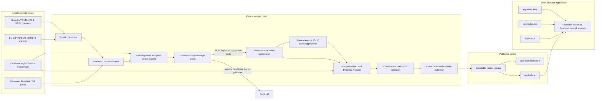
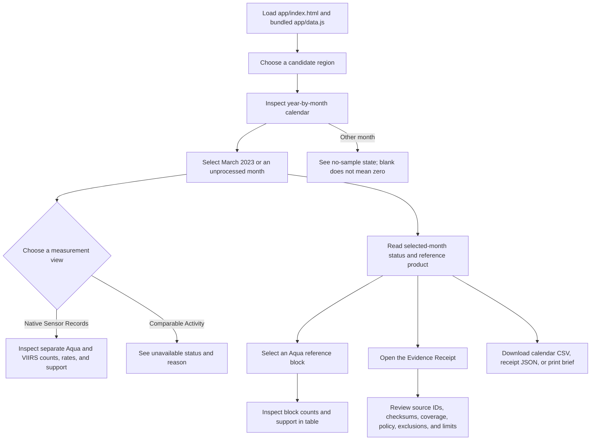

# As-built architecture and data flow

This guide records the implementation that exists in the repository. The target architecture in [the TRD](02-TRD.md) includes future ingestion, calibration, and evaluation stages; those are not part of the current runnable path. The current product is a local raster-processing build that publishes static data for a browser application.

## System boundary

The pipeline is the science boundary. It reads stored NASA files, applies declared product and region rules, and publishes a versioned artifact bundle. The browser displays the bundle and offers navigation and export controls. It does not read HDF files, run a model, make an estimate, or connect to an application backend.



The build is **offline with respect to NASA services**: source granules are already stored under `data/timeseries/`, and the current builder does not query CMR or download data. The browser is also offline-capable after the static files are available. These are separate claims: the first is a local input workflow; the second is a local presentation workflow.

## Build stages

| Stage | Implemented module or path | Work performed | Failure behavior |
|---|---|---|---|
| Select sample and inputs | `pipeline/fireseason/sample.py` | Selects the stored files covering March 2023 and the two candidate windows. Records product versions, source object names, sizes, and SHA-256 values. | Missing source files or unusable sample inputs stop the build. |
| Decode products | `pipeline/fireseason/decoder.py`, `pipeline/fireseason/raster_analysis.py` | Reads MODIS HDF4 and VIIRS HDF5 arrays and product grid metadata. | Unsupported structures or mismatched FireMask/QA dimensions stop decoding. |
| Classify observation states | `pipeline/fireseason/raster_analysis.py` | Applies the versioned QA-land and FireMask policy to produce eligible, valid, and detected masks. | Invalid array shapes or unsupported grid assumptions raise an error. |
| Clip and align | `pipeline/fireseason/sample.py`, `pipeline/fireseason/raster_analysis.py` | Projects candidate bounds, tests native pixel centers against the region, and checks the grids align. | Grid mismatch or empty/incompatible region inputs stop the build. |
| Verify daily coverage | `pipeline/fireseason/sample.py`, `pipeline/fireseason/raster_analysis.py` | Requires exactly one observation for every date from March 1 through March 31, 2023, for both products. | Missing, unexpected, or duplicate dates fail closed. |
| Aggregate native evidence | `pipeline/fireseason/sample.py` | Sums eligible, valid, and detected cell-days by product and candidate region. Computes native rate and support from sufficient counts. | No usable support yields a null rate/status; it is not converted to zero activity. |
| Aggregate map blocks | `pipeline/fireseason/raster_analysis.py` | Groups Aqua reference-product counts into 10×10 native-grid blocks for the heatmap and detail table. | Non-divisible or incompatible arrays fail instead of silently shifting block boundaries. |
| Construct evidence | `pipeline/fireseason/science_release.py` | Builds the native-only Analysis Artifact, Evidence Receipt, evaluation placeholder, candidate GeoJSON, and declared limitations. | Incomplete or inconsistent artifact fields fail contract validation. |
| Validate and publish | `pipeline/fireseason/contract.py`, `pipeline/build_research_bundle.py` | Checks artifact/receipt relationships, manifest inventory, sizes, checksums, and immutable-release identity; writes a temporary bundle and renames it into place. | A changed geometry under an unchanged region revision or payload mismatch is rejected. |
| Prepare browser data | `pipeline/build_research_bundle.py` | Updates the region index and bundles artifacts, receipts, and block records into `app/data.js`. | Publication only updates browser data after region releases are available. |
| Render and export | `app/index.html`, `app/app.js`, `app/styles.css` | Reads bundled JSON-like data, manages view state, formats evidence, draws the calendar and block grid, and downloads/prints files. | Missing browser data prevents rendering; the browser does not attempt to invent replacement scientific values. |

The installed science dependencies are pinned in `pipeline/requirements-science.lock`: NumPy, h5py, pyhdf, and pyproj. The application itself uses browser-native JavaScript and CSS. The current implementation does not use React, Vite, a JavaScript charting package, or a runtime API.

## Data and artifact path

```text
data/timeseries/
  modis/                         stored MYD14A1 HDF4 granules
  viirs/                         stored VNP14A1 HDF5 granules

app/data/releases/<region>/r2/<source-manifest>-<release-fingerprint>/
  analysis.json                  monthly native records and unavailable states
  evidence-receipt.json          data, policy, provenance, environment, limits
  manifest.json                  published payload inventory and SHA-256 checksums
  calendar.csv                   one row per product/month native record
  block-month.csv                Aqua reference-product block evidence
  evaluation.json                explicit not-evaluated status
  region.geojson                 candidate region geometry
  monitoring-brief.html          prebuilt printable evidence brief

app/data/index.json              list of the published candidate-region artifacts
app/data.js                      browser bundle of index, artifacts, receipts, blocks
```

The release directory is immutable by convention and checked on reuse. The generated `artifact_id` binds the inputs and build identity. The manifest records each payload's type, byte size, and checksum. The Evidence Receipt carries source granule identities, source checksums, daily coverage, the quality policy, exclusions, runtime details, and limitations. The original local retrieval timestamps are unknown and explicitly left unknown in the receipt.

### Artifact roles

- **`analysis.json`** is the UI's scientific record: region and period identity, metric definition, source products, native monthly counts and rates, support, comparison/anomaly/priority statuses, and limitations.
- **`evidence-receipt.json`** makes the result inspectable: it points to product versions, source objects, exclusions, quality policy, input manifest, software environment, and limitations.
- **`manifest.json`** is the release-level inventory of exact bytes, sizes, and checksums.
- **CSV and GeoJSON files** expose tabular observations, block records, and region geometry for reuse.
- **`evaluation.json`** currently states `not_evaluated`. It is not evidence of model performance.
- **`monitoring-brief.html`** is a fixed-content summary built from the artifact and receipt. It does not use an LLM.
- **`app/data.js`** is a generated convenience bundle for the static app, not the authoritative source of provenance. The individual release files and manifest remain available.

## Measurement and evidence semantics

The daily planes are decoded under a declared policy. QA land cells are eligible. Clear non-fire land and nominal/high-confidence fire cells are valid. Nominal/high-confidence fire cells count as detected. Low-confidence fire, cloud, unknown, unprocessed, water, and non-land states do not enter the valid denominator or detected numerator; the QA-land eligible denominator preserves their effect on support where applicable.

For a product and region, the native rate is:

```text
1,000 × detected active land-cell-days / valid observed land-cell-days
```

The two products remain separate because the products have different measurement systems. A lower VIIRS rate beside an Aqua rate is not itself a calibration estimate. The current release has one month, no frozen boundary, and no independent temporal or geographic evaluation. Therefore:

- `Comparable Activity` is `calibration_not_released` with null estimate and interval fields.
- `Activity Anomaly` is `indeterminate` because a same-month baseline does not exist.
- `Investigation Priority` is `unavailable` because no independently evaluated rule exists.
- Unprocessed calendar months carry no observation and are shown as unprocessed, not zero.

The browser formats these states and derives display-only visual scales. It does not modify the underlying scientific counts or estimate harmonized values.

## Browser interaction flow



This flow stays local to the browser. Region and month controls change the selected bundled records; the app does not issue network requests. The mobile layout offers the same month selection as a list. The block grid and table provide both visual and tabular access to the Aqua reference-product data.

## Contracts and source of truth

`backend/schemas/` contains versioned JSON schemas. The producer also uses the behavioral and cross-field checks in `pipeline/fireseason/contract.py`, since JSON Schema alone cannot prove that an artifact's checksum, receipt, file inventory, or domain fields agree. `pipeline/tests/` covers those contracts and the scientific sample processing.

Use the following precedence when a document describes a future capability differently from the implementation:

1. Published raster inputs, `analysis.json`, `evidence-receipt.json`, and `manifest.json` are the source records for the current sample.
2. `pipeline/` is the source of truth for build behavior.
3. `app/` is the source of truth for current browser behavior.
4. [Implementation status](09-IMPLEMENTATION-STATUS.md), [core features](12-CORE-FEATURES.md), and this file describe the as-built scope.
5. The PRD, TRD, and model protocol describe target behavior unless a feature is confirmed in the as-built docs and code.

## Next scientific stages

The minimum next work is to confirm and revision-freeze the candidate regions, inspect raster availability across multiple seasons, and build enough complete samples for predeclared temporal and geographic tests. Then compare candidate methods with simple baselines, assess independent reference evidence, test uncertainty coverage, and publish a Calibration Release only if the gates pass. Until then, keep the application native-only and retain its unavailable comparison state.

For the detailed list of implemented and absent functionality, see [core features and current limits](12-CORE-FEATURES.md). For the quick run and validation commands, see the [root README](../README.md).
